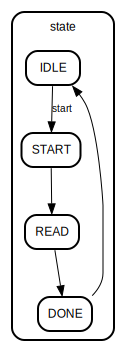

# Entity: adc_controller 
- **File**: [ADC.v](ADC.v)

## Diagram

## Ports

| Port name | Direction | Type        | Description                |
| --------- | --------- | ----------- | -------------------------- |
| clk       | input     | wire        | 系统时钟信号               |
| rst_n     | input     | wire        | 复位信号，低电平有效       |
| start     | input     | wire        | 启动信号，启动ADC转换      |
| data      | output    | [15:0]      | 16位ADC数据输出            |
| busy      | output    |             | ADC忙信号，表示ADC正在操作 |
| cs_n      | output    |             | 片选信号，低电平有效       |
| rd_n      | output    |             | 读信号，低电平有效         |
| adc_data  | input     | wire [15:0] | 16位ADC数据输入            |

## Signals

| Name  | Type      | Description                          |
| ----- | --------- | ------------------------------------ |
| state | reg [3:0] | 状态寄存器，用于保存状态机的当前状态 |

## Constants

| Name  | Type | Value | Description                          |
| ----- | ---- | ----- | ------------------------------------ |
| IDLE  |      | 4'd0  | 初始状态，等待启动信号               |
| START |      | 4'd1  | 断言cs_n和rd_n以启动ADC转换          |
| READ  |      | 4'd2  | 读取ADC数据并存储在数据寄存器中      |
| DONE  |      | 4'd3  | 取消断言cs_n和rd_n，并返回到IDLE状态 |

## Description
`adc_controller` 模块用于控制AD7606 ADC芯片，实现对ADC的启动、数据读取和状态管理。该模块通过状态机控制ADC的操作。

## Processes
- unnamed: ( @(posedge clk or negedge rst_n) )
  - **Type:** always
  - **Description:** 在每个时钟（clk）的上升沿，状态机根据当前状态和输入信号进行状态转换。在复位时（rst_n为低电平），状态机设置为IDLE状态，数据清零，控制信号取消断言。

## State machines

